# WordUp

A flashcard-generating application, used for vocabulary acquisition. This application was inspired by my love of language learning and allows users to create and share flashcards, and also test themselves. The logic ensures repetition of the flashcards which the user finds more difficult to remember.

<kbd>
  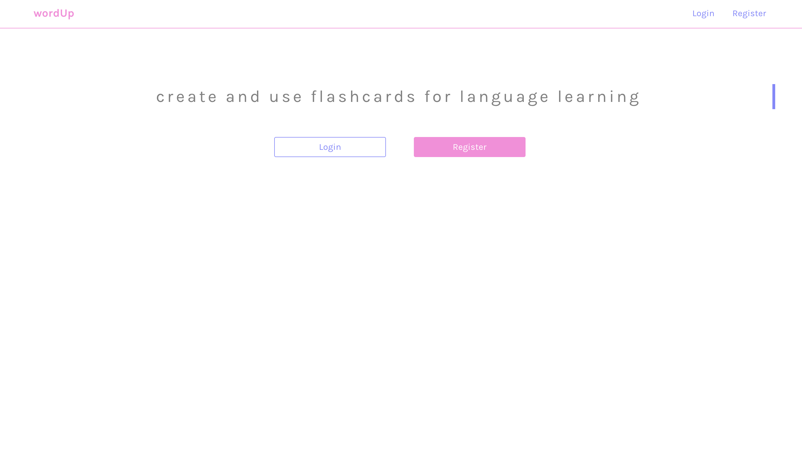
</kbd>

### Installation and Setup

**Run locally**

* Download or clone the GitHub repo

**View online**

* [View on Heroku](https://mysterious-anchorage-60146.herokuapp.com)
* View on GitHub

### Technologies used

During the creation of this project, I used the following technologies:

* Animate CSS
* Axios
* Babel
* bcrypt
* Bluebird
* Body-parser
* Chai
* Enzyme
* Express
* Font Awesome
* Git
* GitHub
* Heroku
* HTML 5
* JavaScript (ECMAScript 6)
* JSON Web Token
* Lodash
* Mocha
* MongoDB
* Mongoose
* Morgan
* Node.js
* NYC
* React
* SCSS
* Sinon
* Supertest
* Webpack

After logging in, users are directed to their profile page. Here are listed the flashcard decks that they have created and also, in a separate list, the flashcard decks that they have favourited.

<kbd>
  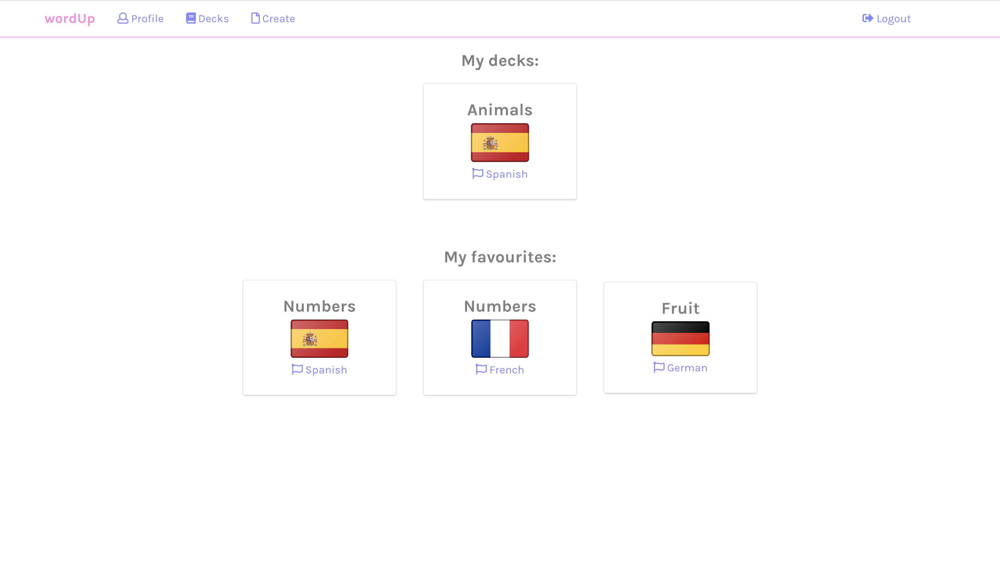
</kbd>

The users own decks are stored in a virtual 'myDecks' on the user model, whilst the favourites are a virtual 'favourites' on the deck model. Both are shown here by populating the myDecks and favourites field when making the request to the back-end.

On the decksIndex page, users have access to all decks created by themselves or by other users.

<kbd>
  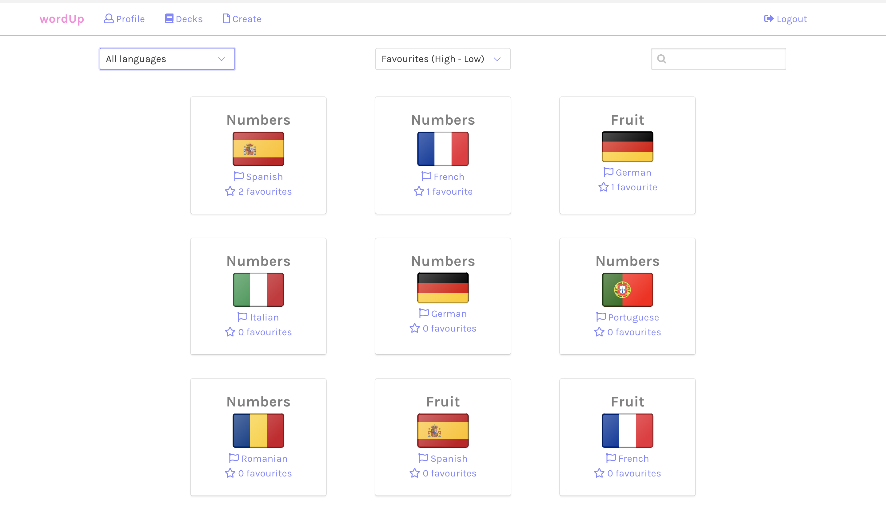
</kbd>

Users can filter the decks by a particular language or by typing in the name of the deck. All decks (or search results) can be ordered according to the number of favourites, or may be ordered alphabetically.

The filtering and sorting takes place on the front end. Each of the select boxes, or input box for the search, has a handler attached to it, which updates state if changed. The direction of the sort is, by default, set to descending, so decks with the most favourites are shown first.

When a user clicks on a particular deck, a request is made to the back-end for data relating to the deck in question. The flashcards of that deck are stored as an array on state. The user is given the word in English and their challenge is to say this word out loud.

<kbd>
  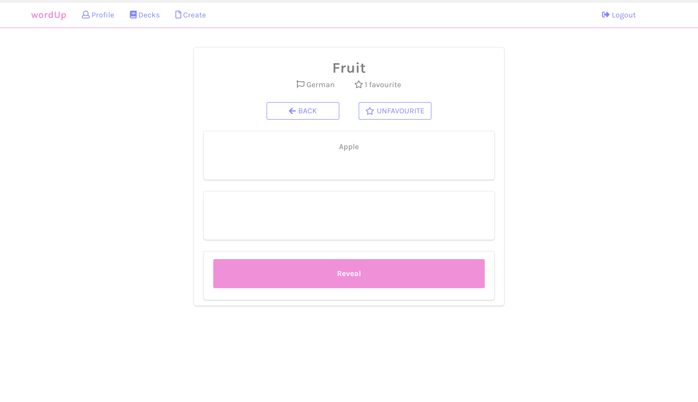
</kbd>

Once they have done this, or they have decided that they are unable to recall the word, they click the 'Reveal' button. They are prompted to state whether their answer was correct or incorrect.

<kbd>
  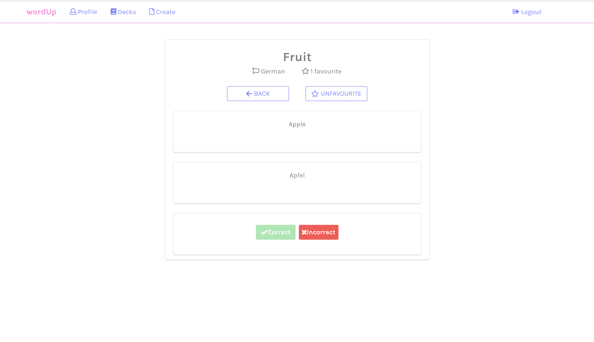
</kbd>

If they clicked correct, the card is deleted from the array and will not appear again. If they clicked correct, the card will be pushed to the end of the array, so it will appear again.

The user is informed that they have completed the deck once there are no cards left in the array.

### Wins

* The application is fully mobile responsive. As wordUp is designed for regular and quick vocabulary testing, it is vital that it functions on mobile devices. This was achieved through a mobile-first design approach, using Balsamiq wireframes during the planning stage.

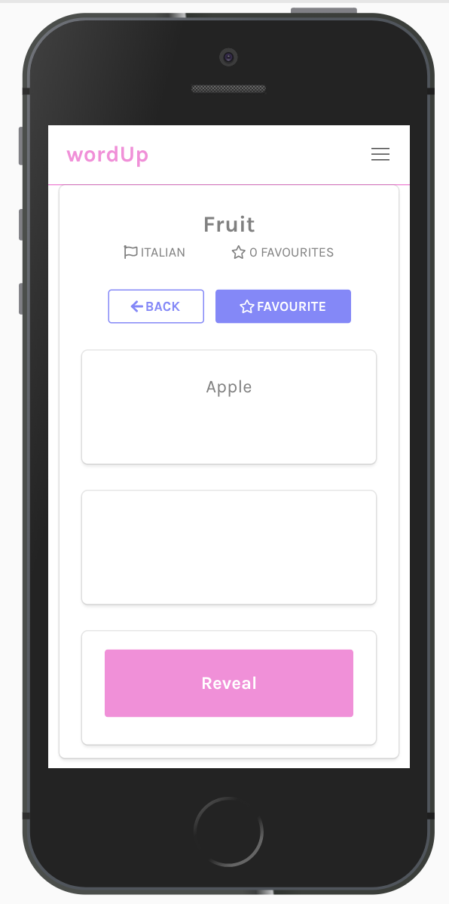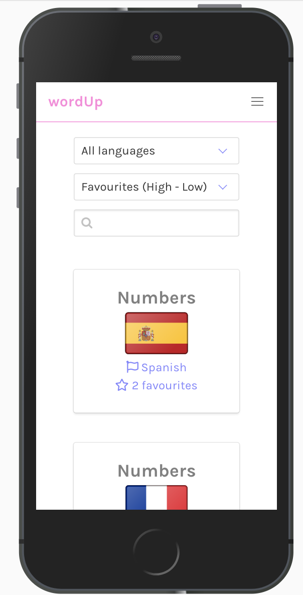

* Form validation takes place throughout the application, improving its UX. In addition to the messages shown alongside the inputs (as in the screenshot below), the 'Save' button is disabled by the front-end until the input is sufficiently modified.

<kbd>
  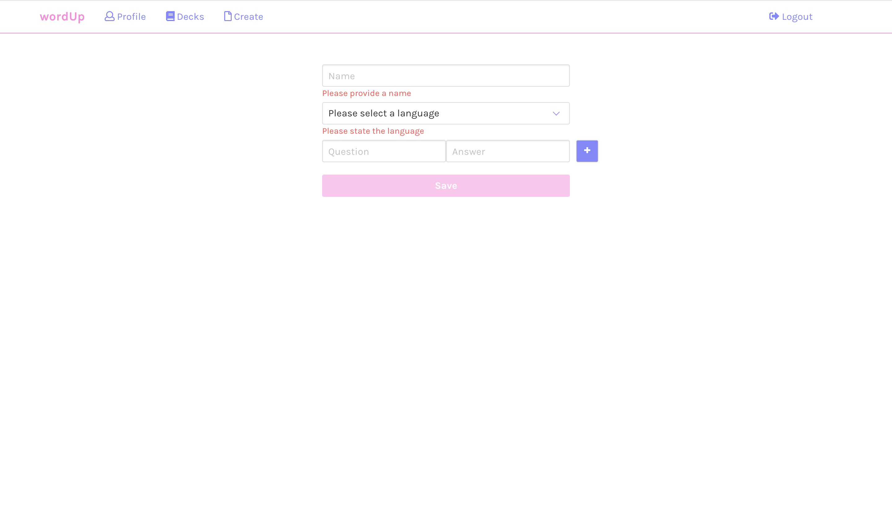
</kbd>

* Another aspect of form validation is in place on the above screenshot. The '+' button (used to add a card to a deck) cannot be clicked unless a question and answer (both sides of the flashcard) have been written.

* The back-end has been tested comprehensively:

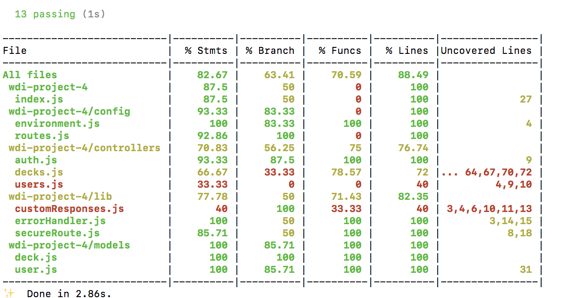

* A clean, fresh design was achieved on this project. This is particularly down to the integration of Animate CSS for the pop up messages during form validation and also during flash-card utilisation - giving the app a slick, professional feel. Bulma.io was used for its lightweight feel and customised using a colour palette from the Coolors website, providing an individual edge. FontAwesome icons also enhance the appearance of the app.

### Challenges faced

When the user has correctly answered all of the cards, a message is displayed informing that the deck has been completed. This message is prompted by the array length being equal to 0. However, this message would be shown if the deck did not contain any cards to begin with, and would not be suitable in this instance.

In order to avoid this, I created a currentIndex to state, which begins at 0. The currentIndex variable is incremented by 1 each time a user answers a card. If cards array and current array both equal 0, a message is displayed informing that there are no cards in the deck.

If the cards array is equal to 0, whilst the currentIndex is greater than 0, a congratulatory message is displayed to the user, informing them that they have completed the deck.

<kbd>
  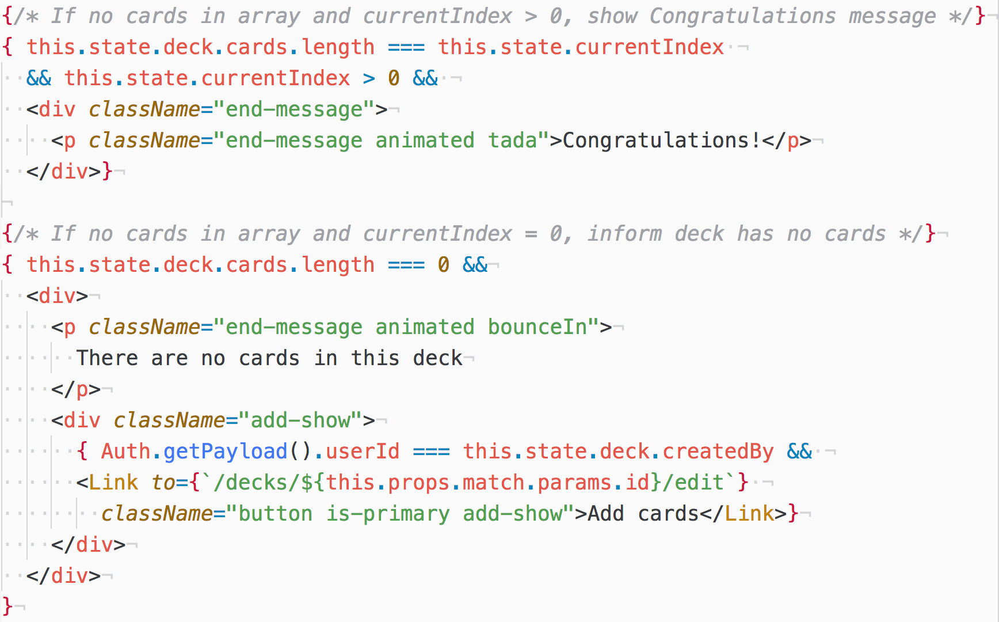
</kbd>

This was my first large-scale project built using React. As such, it proved difficult to plan the project. This challenge was overcome by using Trello during the planning stage to ensure that each process was thought through prior to the build stage.

<kbd>
  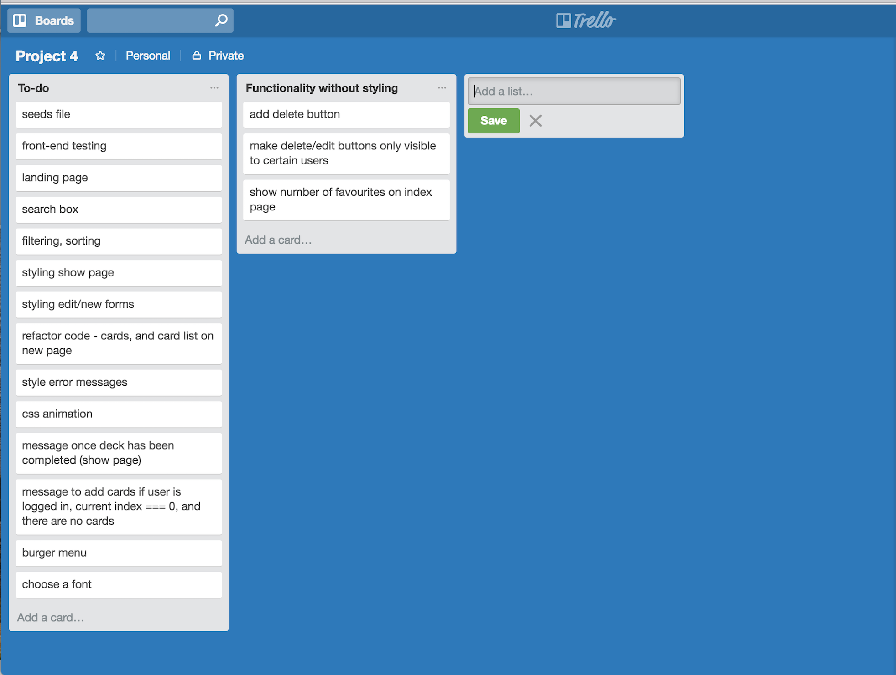
</kbd>

### Where next?

* I would like to incorporate a translation API into the flashcard-creation process of the app. This would allow users to create flashcards by typing in the word in English, then the API would translate this for them into the target language.

* I have noticed that when the cards are loading (when user has first navigated to decksShow), the cards can take a few seconds to load. I would like to create a 'loading' animation, in order to give a slicker, more professional appearance.
